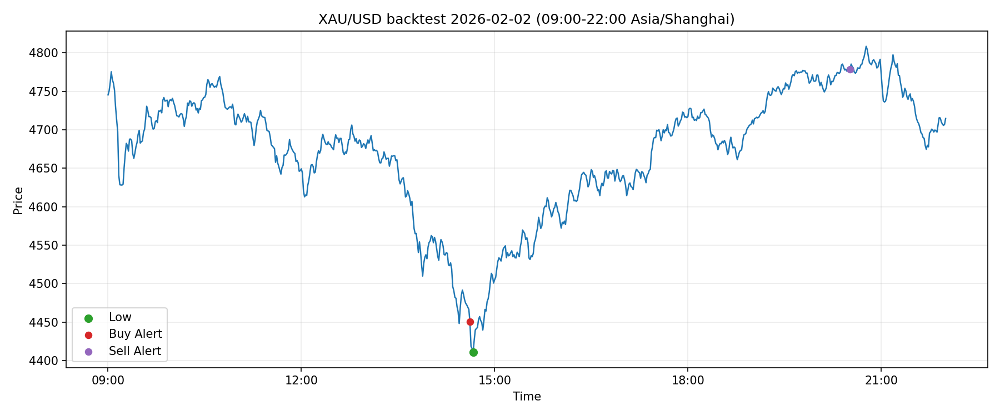
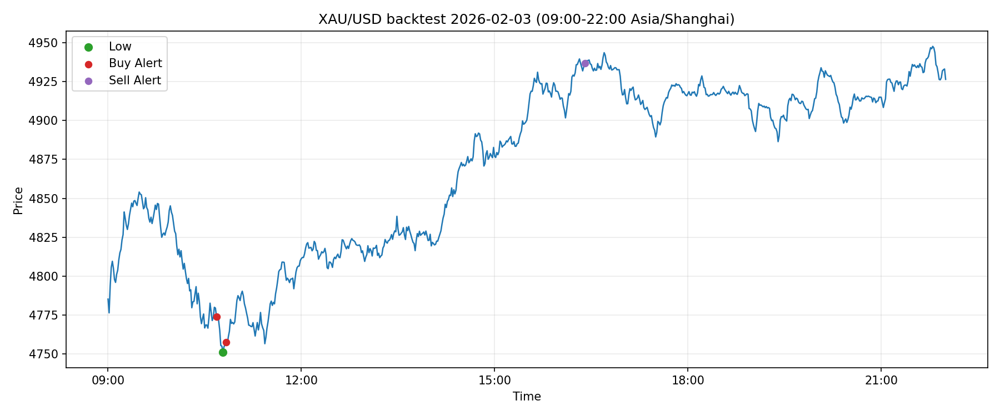
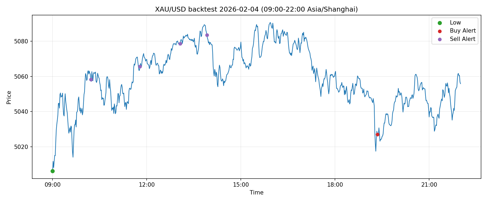
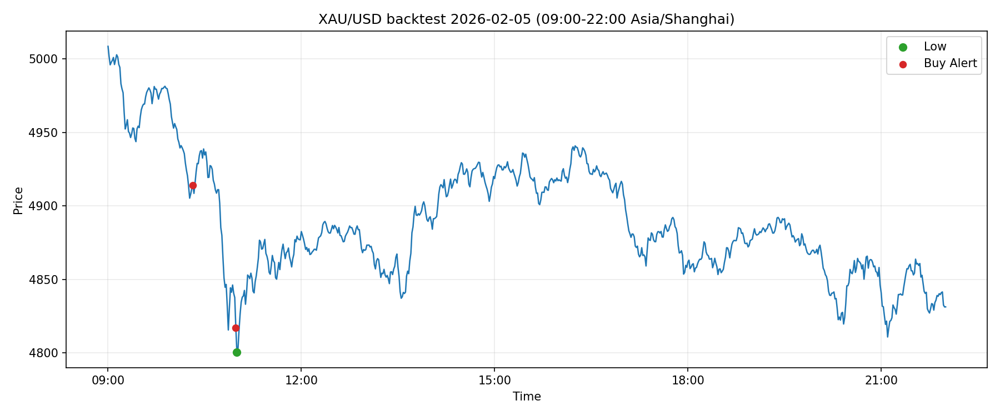
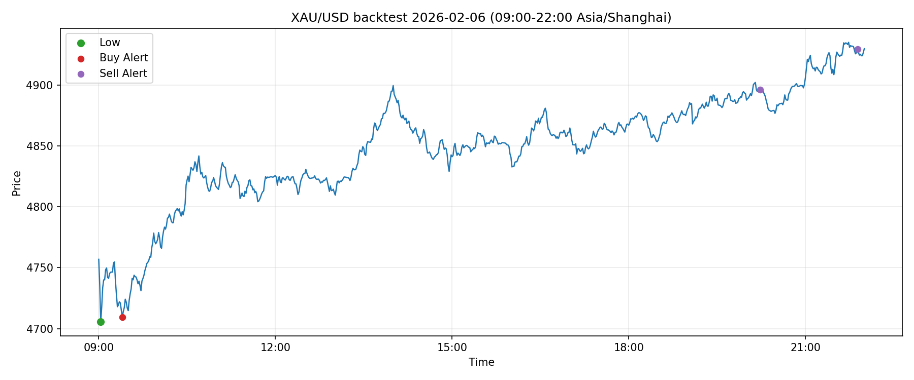
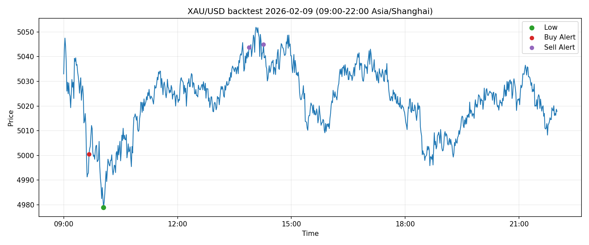

# GoldPulse-Sentinel

对国际黄金金价的分钟级提醒：默认找买点（下跌动能减弱），可选开启卖点（上行动能减弱）。基于概率判断，不保证买在最低或卖在最高。

## 快速开始

1. 依赖：pip install python-dotenv twelvedata matplotlib
2. 去https://twelvedata.com/account/api-keys注册账户并拿到 api-keys，通过该 api 爬取分钟级金价数据。
3. 复制 `config.example.env` 为 `.env`，填好：
   - `TWELVEDATA_API_KEYS`（或单个 `TWELVEDATA_API_KEY`）
   - `SMTP_PASSWORD`（邮箱的授权码，需要去对应的邮箱网页端获取，不是登录密码！）
   - 发送邮箱'SMTP_FROM'以及接收邮箱'SMTP_TO'
   - 若使用多个 API key ,用英文逗号分隔，程序会轮询使用并在配额/限流时自动切换
     
4. 测试邮件是否能发出去：
```bash
python3 goldx_alert.py --test-email
```
> 如果你用 Twelve Data 免费额度，建议把 `POLL_SECONDS` 设为 `120` 或更大，或只在你关注的时段运行。

测试只跑一次能否成功：

```bash
python3 goldx_alert.py --once
```

正式运行：
```bash
python3 goldx_alert.py
```

## 回测模拟，自动出图

用“只看当下与过去，不看未来”的方式，把某天某个时间段逐分钟模拟跑一遍，输出程序会在哪些点提醒。

```bash
python3 goldx_alert.py --backtest --date 2026-02-05 --start 09:00 --end 22:00
```

> 回测会按 `date/start/end` 定向拉历史数据；建议保留较大的 `--outputsize`（如 `5000`），避免数据源只返回默认约 30 条。

输出默认在 `backtest_out/<symbol>/<date>/`：

- `alerts.csv`：每次提醒的时间/价格/指标/理由（含 `side=BUY/SELL`）
- `summary.json`：本次回测的参数与统计
- `full.png`：整段区间价格 + 所有提醒点

> 回测默认会缓存拉取到的数据到 `backtest_cache/`，反复调参时不会重复消耗 API 请求；需要强制刷新可加 `--refresh-cache`。
>2026-02-02 到 2026-02-09的回测效果图如下:







## 参数怎么调（核心参数）
### 设置监控时间
在 `.env` 里设置：
- `MONITOR_TZ=Asia/Shanghai`
- `MONITOR_START=09:00`
- `MONITOR_END=24:00`

### 相关参数
- `REBOUND_PCT`：从“最近低点”反弹到多少开始考虑提醒
- `REBOUND_MAX_PCT`：反弹上限，超过就认为追高不提醒（设为 0 可关闭）
- `LOW_MAX_AGE_MIN`：低点需是“最近多少分钟内”的低（设为 0 可关闭）
- `LOW_ZONE_SLOPE_MIN_PCT_PER_MIN`：低位提前通道斜率阈值（可略负，避免过度漏报）
- `MIN_BARS_TO_START`：最小起算样本数（避免启动初期全盲）
- `EARLY_SCORE_THRESHOLD`：低位提前通道的积分触发阈值
- `BUY_HTF_SLOPE_WINDOW_MIN` / `BUY_HTF_SLOPE_MIN_PCT_PER_MIN`：买入高周期下跌硬过滤（下跌过强时不报，`-1` 可关闭）
- `BUY_SOFT_DOWNTREND_SLOPE_PCT_PER_MIN`：买入中等下跌态判定阈值（`-1` 可关闭）
- `BUY_SOFT_DOWNTREND_REBOUND_BOOST_PCT` / `BUY_SOFT_DOWNTREND_STALL_BOOST_MIN` / `BUY_SOFT_DOWNTREND_SCORE_BOOST`：下跌态下自动加严反弹、停跌、分数门槛
- `BUY_SOFT_DOWNTREND_SHORT_SLOPE_MIN_PCT_PER_MIN`：下跌态下短周期止跌参考（未满足会加惩罚分，降低早抄底触发）
- `BUY_HARD_FILTER_NEAR_SESSION_LOW_BYPASS_PCT` / `BUY_HARD_FILTER_BYPASS_REBOUND_PCT`：极近会话低点且反弹达标时可豁免买入硬过滤，减少漏底
- `COOLDOWN_MINUTES`：发过一次后多久不再提醒（防止震荡刷屏）
- `BUY_COOLDOWN_BYPASS_ON_FRESH_LOW`：新低场景是否允许突破冷却立即补报买点
- `BUY_BYPASS_LOW_MAX_AGE_MIN` / `BUY_BYPASS_DIST_FROM_SESSION_LOW_PCT`：冷却豁免生效时对“低点新鲜度/贴近低点”的限制
- `BUY_BYPASS_MIN_NEW_LOW_DROP_PCT`：要求会话低点相对上次买入至少再下破的幅度，避免冷却豁免刷屏

## 双锚点过滤（更贴近低点、减少追高）

- `QUANTILE_WINDOW_MIN`：滚动分位窗口长度
- `Q_LOW`：低分位阈值（<=该分位可触发“提前提醒”）
- `Q_SKIP`：高分位阈值（>该分位直接不提醒）
- `ABSOLUTE_MAX_PRICE`：绝对价格硬上限（如 5000，超过即直接过滤不提醒）
- `STALL_MIN`：停跌时间参考（在积分里加权，不再是硬门槛）
- `MICRO_REBOUND_PCT`：微反弹参考阈值（在积分里加权）
- `GLOBAL_WINDOW_MIN`：全局锚点窗口长度（建议 1440，代表近 24h）
- `EARLY_NEAR_GLOBAL_LOW_PCT`：若接近全局低点（如 0.10% 内）可走低位提前通道
- `MAX_DIST_FROM_GLOBAL_LOW_PCT`：全局低点的评分锚值（软约束，不做一票否决）
- `MAX_DIST_FROM_SESSION_LOW_PCT`：会话低点硬过滤阈值（防止在当日相对高位追入）

## 开盘低点场景（早低后涨）

- `OPEN_SCOUT_MIN`：开盘抢底通道生效时长（分钟）
- `OPEN_SCOUT_SCORE_THRESHOLD`：开盘抢底通道触发分数阈值
- `OPEN_SCOUT_MAX_ALERTS_PER_SESSION`：每个会话开盘抢底最多触发次数

## 卖出提醒（可选）

- `SELL_ENABLED`：设为 `1` 开启卖出通道（默认 `0`，仅买入通道）
- `SELL_Q_HIGH` / `SELL_Q_SKIP_LOW`：卖出分位范围（越靠近高分位越偏顶部）
- `SELL_PULLBACK_PCT` / `SELL_PULLBACK_MAX_PCT`：从近高点回撤的触发区间
- `SELL_MAX_DIST_FROM_SESSION_HIGH_PCT`：离会话高点过远时硬过滤（防“低位补报卖点”）
- `SELL_HTF_SLOPE_WINDOW_MIN` / `SELL_HTF_SLOPE_MAX_PCT_PER_MIN`：高周期趋势硬过滤（上涨太强时不报卖点）
- `SELL_REARM_ON_NEW_HIGH_PCT`：同一会话卖出“新高重置”阈值，抑制连续密集卖点
- `SELL_EARLY_SCORE_THRESHOLD`：卖出高位提前通道积分阈值
- `SELL_OPEN_SCOUT_*`：开盘抢卖通道参数，含会话内提醒上限

## 邮件提醒附图

- `ALERT_PLOT_ON_EMAIL`：实盘提醒邮件是否附带本次 alert 的图（默认 1）
- `ALERT_PLOT_DIR`：图片输出目录（默认 `alert_out`）
